# FPGA based Oscilloscope

## Overview
It is intended to build an oscilloscope with hardware resource in FPGA involving the development of the following functionalities:
- Signal acquisition;
- Signal processing functions:
  -  Low-Pass Filter (LP);
  -  Band-Pass Filter (BP);
  -  High-Pass Filter (HP);
- Graphic support through HDMI display, with hardware implemented controller.

## Block Diagram
The Processor System (**PS**) block is responsible for configuring and initializing **XADC**. When the ADC is configured, a configuration flag must be activated, through the AXI Config slave register. In addition, PS allows debugging the main lines of the system, such as the value converted by XADC (ADC_Val) or the result of applying filters (Result), through the use of an AXI slave **debug IP** (Debug). The Read XADC block is an AXI-Lite master block that waits for the XADC to be configured by the PS and performs the respective readings to the ADC registers, putting it in the output (ADC_Val). The sampling frequency set for this system was 1 kHz and, since the XADC has a sampling frequency of 1 MHz, an IP was implemented that performs the **average** of the values converted by the XADC, in a sampling period (1 ms). The average value is cleaned at each sampling and this frequency is defined by the IP Sample These signals and the filter selection signal (filter_select) are used by the **filter block** (Filters) in order to apply the respective filter on the signal read by the XADC. The signal after applying the filter (result) enters the production block and image transmission via HDMI (**HDMIIP**). This block uses different clock sources for different tasks: **clkRD** is the frequency of reading the image into memory; **clkWR** to write the image to memory; **Pixclk** represents the reading frequency of a pixel of the image to be transmitted; **TMDS_clk**, defined by the HDMI protocol, represents the frequency at which HDMI signals are switched, as per the pixel read.

All IPs that use an AXI-Lite interface are connected to a bus IP, called AXI Interconnect, and all communications must be initiated, through the respective AXI protocol handshake, by an IP with an AXI-Lite interface master (AXI_M) which have mapped IP addresses with AXI-Liteslave interface (AXI_S).
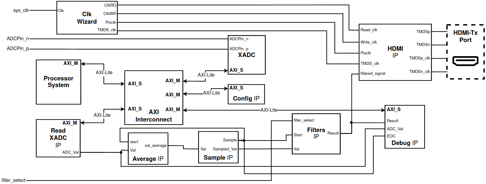

### Filter IP
<!-- This block can be seen as a filter multiplexer for a given input value. The filter-select input is the selector of the signal to be presented at the output of the block (result). This signal is equal to the input signal if the selector is 11; equal to the input signal after applying an LPF, if the selector is 00, and so on. The start signal allows starting the filtering process. Initially, an update of the previous input values must be made, using the RBUF block. This allows you to update the BRAM used to store previous input values, the BRAM X_ANT. After this update is made, signaled through the signal
done, the start signal is given to the selected filter. Each filter needs the previous input values and the respective coefficients, so it is necessary to control the read addresses of the BRAMs.-->
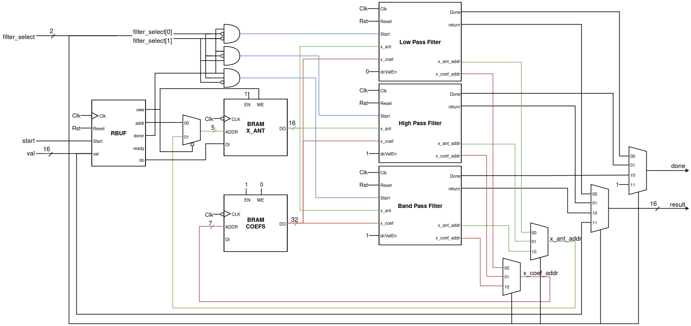

### HDMI IP
<!-- Below is the block diagram of the IP that interfaces with the HDMI port, being responsible for, through the filtered signal, producing and transmitting an image at the standard frequency of 60 Hz. The Write Block produces the image, through the value calculated by the IP Filters,filtered_signal. Thus, a wave should be represented in the image, according to this value at each instant, the wave being represented in green (RGB - 00FF00h) and the rest of the image in black (RGB - 000000h). There are two BRAMs, one for reading the frame to be transmitted and another for writing the next image to be transmitted. The clock sources shown have different frequencies, according to their purpose: TMDS_clk - clock that respects the HDMI protocol (250 MHz); Pixclk - knowing that we have a 640 by 480 image, each pixel with 24 bits, in order to transmit at a standard frequency of 60 Hz, we need a clock with a frequency of 25 MHz. This is the read frequency of a pixel; clkWR - frequency of writing the image into memory. It is intended that the image has a resolution of 100 ms, in order to represent waves of relatively low frequencies and, knowing that the image is 640 pixels long, a memory writing frequency of 6400 Hz is required; clkRD - memory image read frequency (50 MHz) - twice that of Pixclk, due to delays introduced by the read state machine-->
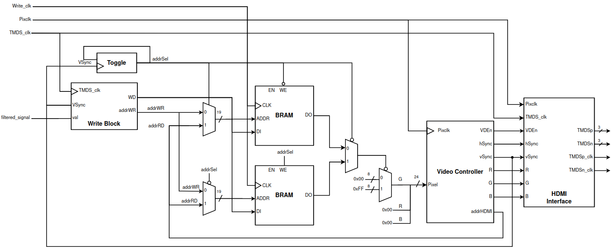

Below is shown the implemented system's block design in Vivado:
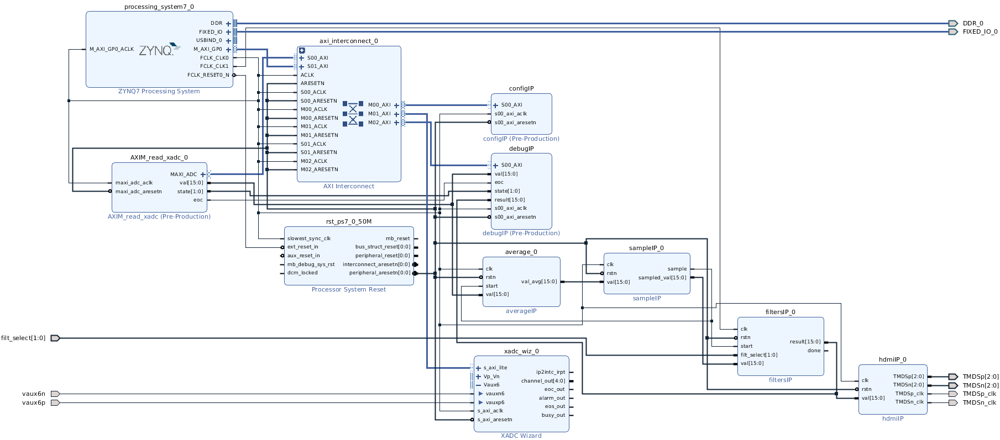

## Results
### LPF
Cut frequency at 50 Hz. Results as expected
20 Hz             |  50 Hz                   | 100 Hz
:-------------------------:|:-------------------------:|:-------------------------:
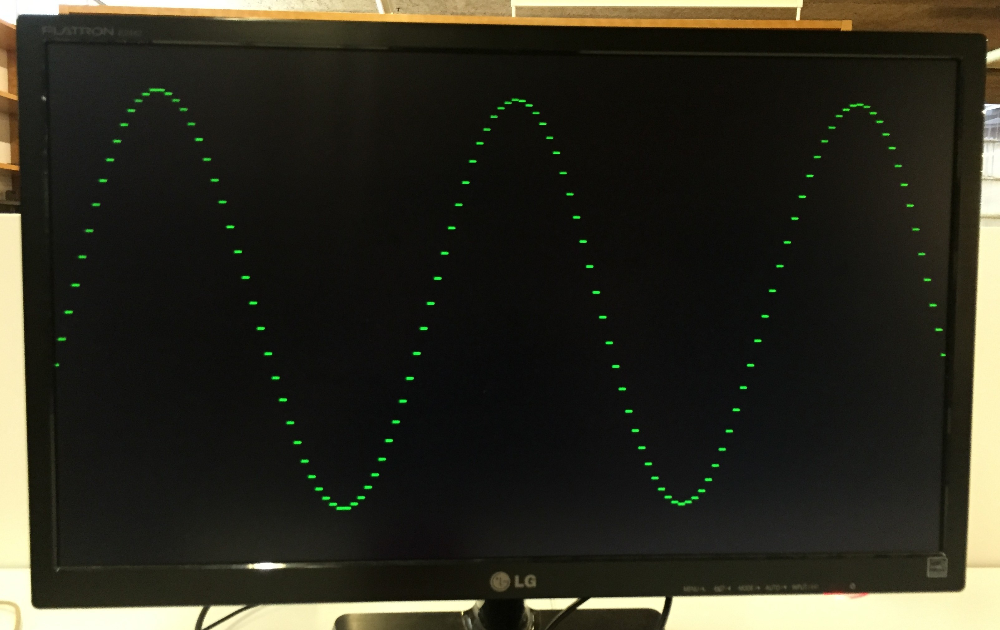  |  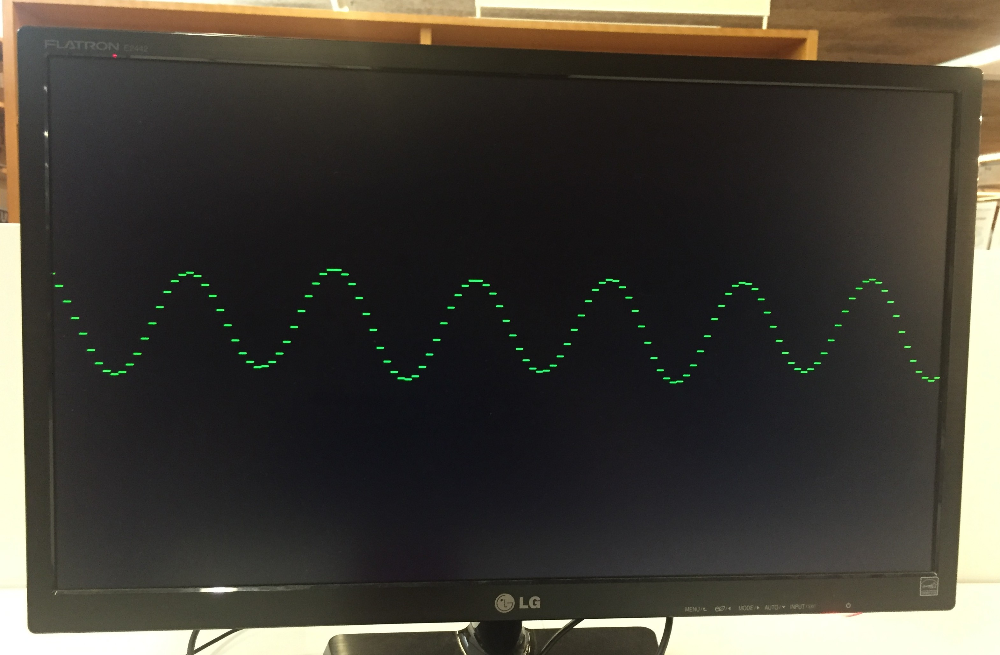 | 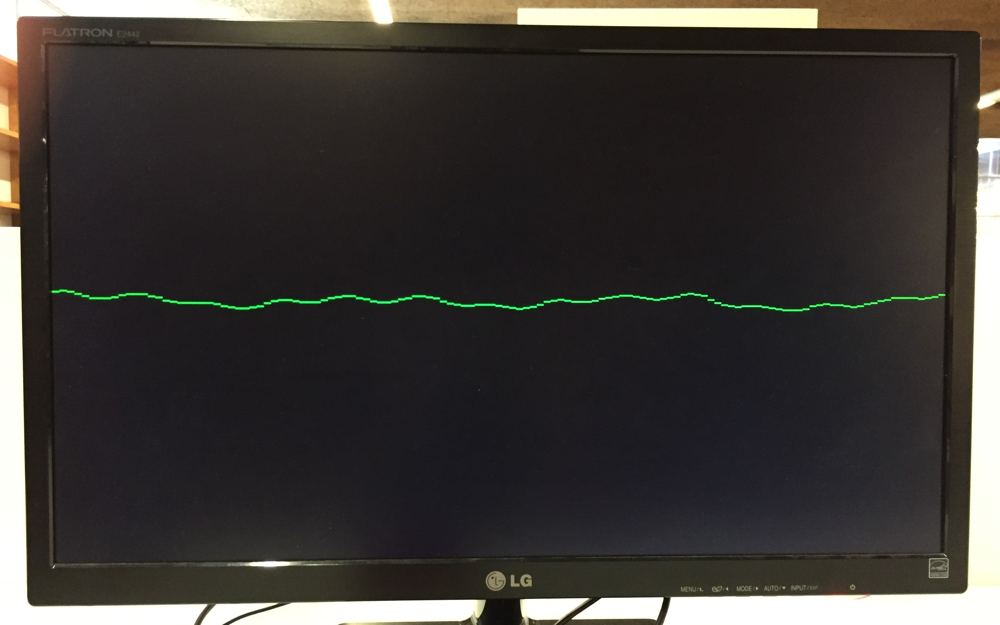

### HPF
Cut frequency at 50 Hz. Response not well defined in the passband (100 Hz)
20 Hz             |  50 Hz                   | 100 Hz
:-------------------------:|:-------------------------:|:-------------------------:
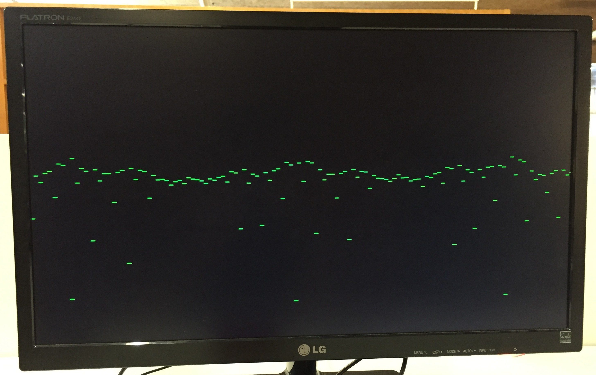  |  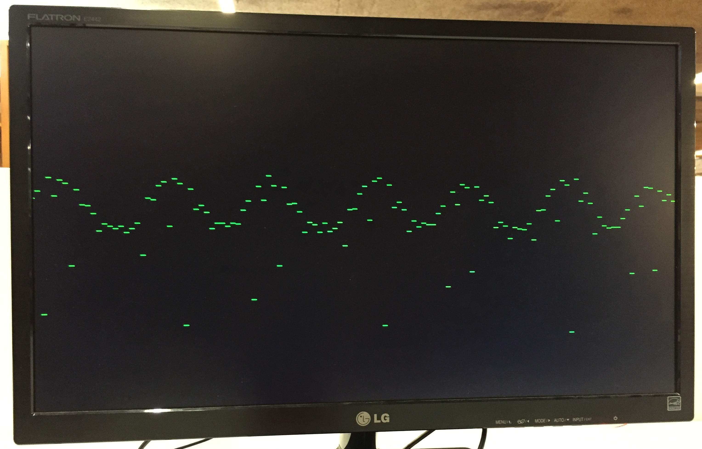 | 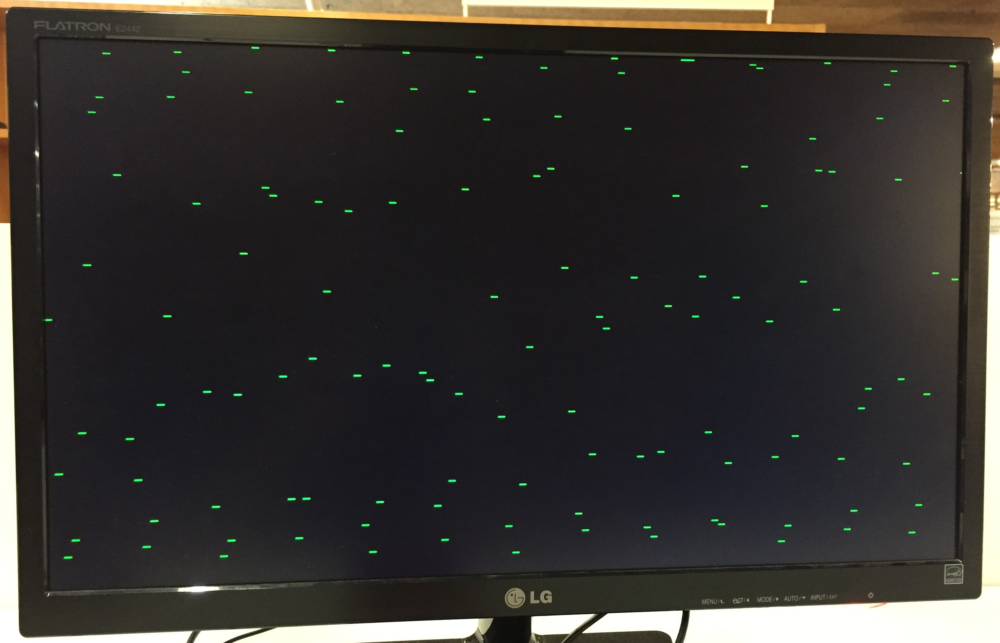

### BPF
Cut frequency at 50 Hz and 150 Hz. Results dont match expected - always on rejection band
20 Hz             |  50 Hz                   | 100 Hz
:-------------------------:|:-------------------------:|:-------------------------:
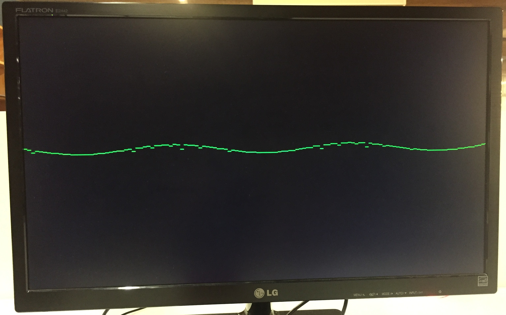  |  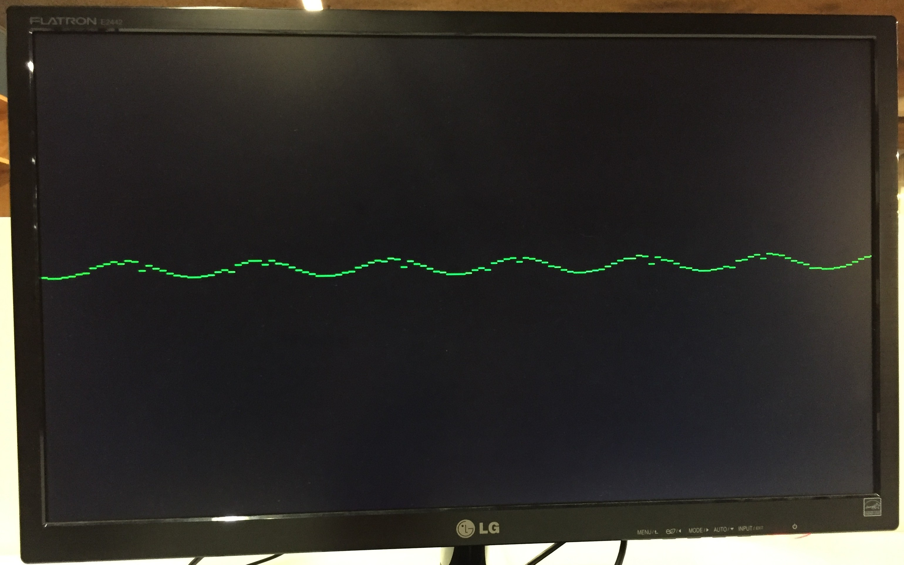 | 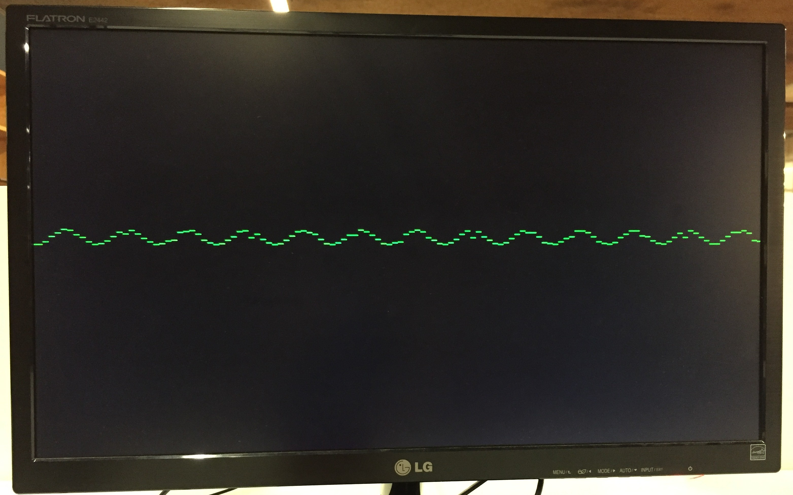

### Tools
- Xilinx Vivado 2019.02
- Xilinx Vivado HLS
- Xilinx Vitis 2019.02

### Hardware
- Zybo Z7: Zynq-7000 ARM/FPGA SoC Development Board

### Documentation
- Final [report](https://github.com/ESRGgroup9/oscilloscope_fpga/blob/main/doc/report/OscilloscopeFPGA.pdf)

## Project tree
- `code/`: project sources
- `doc/`: documentation
- `ext/`: third-party software and development directory:
  - `axi/`: AXI-Lite test with vitis: write and read registers;
  - `bram_read/`: read test to bram;
  - `write_read/`: write test to bram;
  - `dsp/`: dsp latency test;
  - `helloWorld/`: test vitis application;
  - `ips_tests/`: tests developed for some ips:
    - `axi_master_test/`: AXI-Lite master to read and write from slave;
    - `AXIM_read_xadc_1_test/`: AXI-Lite master to read from slave continuously;
    - `filters_test/`: test filters ip;
    - `test_average/`: test average ip;
    - `test_sample/`: test sample ip;
    - `test_average/`: test average ip;
  - `old_ips/`: older versions of ips;
  - `xadc/`: test XADC with vitis application;
  - `xadc_axi/`: final application;
  - `xadc_drp/`: test XADC with DRP interface;
  - `stm_manager/`: STM manager Submodule
- `ips/`: IP's blocks developed for project:
  - `average_ip/`: IP to do average with the sampled values;
  - `AXIM_read_xadc/`: AXI-Lite Master that reads the XADC values;
  - `config_done/`: AXI-Lite Slave that holds the configuration registers;
  - `debugIP/`: AXI-Lite Slave allows debug system sugnals, using registers;
  - `filtersIP/`: IP that filters the digital signal;
  - `hdmiIP/`: IP that controlls and sends signals by HDMI interface;
  - `sampleIP/`: IP that makes the sample frequency;

### Setup
Note that this repository has submodules. When in doubt, follow the next steps:
```shell
$ git clone git@github.com:ESRGgroup9/oscilloscope_fpga.git
$ cd oscilloscope_fpga/
$ git submodule update --init
```

If you use Vivado:
- Launch vivado;
- In TCL Console: 
  - cd <repo_dir>/code;
  - source oscilloscope_fpga.tcl;

In order to debug the application:
  - Program and Debug -> Generate Bitstream;
  - File -> Export -> Export Hardware... (XSA) -> Include bitstream -> Ok;
  - Tools -> Launch Vitis;
  - Select workspace;
  - Create Application Project...
  - Give project a name (Oscilloscope_fpga);
  - Create a new platform from hardware (XSA) -> Hit button plus '+' -> Select XSA generated previously;
  - Select Empty application;
  - Finish;
  - Build;
  - Run -> Run configurations -> Double click in Single Application Debug;
  - Run the Apllication.
 
--------
Directed by:
- Jorge Cabral
- Rui Machado
- Sofia Paiva

Done by:
- Tomás Abreu
- Diogo Fernandes

Engenharia Eletrónica Industrial e Computadores @ Universidade do Minho, 2022
